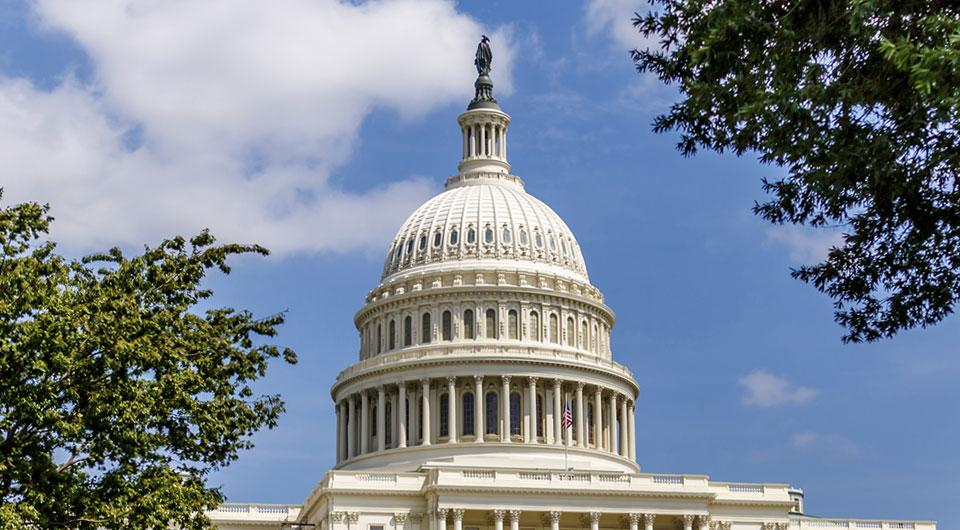
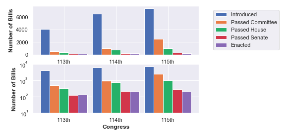
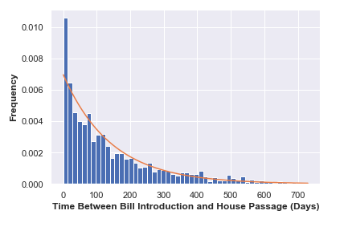
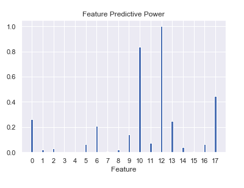
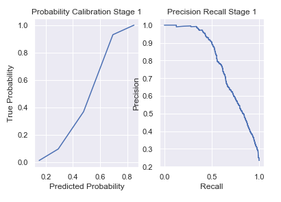
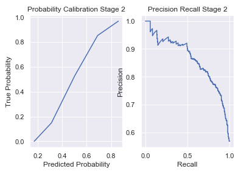
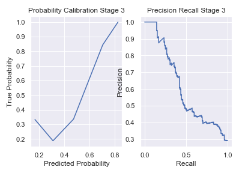
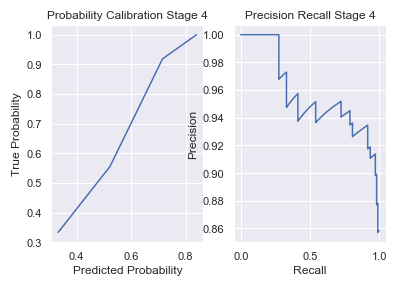

# Predicting the Passage of Congressional Bills
*Of the thousands of bills introduced in the House of Representatives each congress, only a small fraction will pass committee- the first step in the long journey towards becoming a law. Of those few, fewer will be brought to House floor, and even fewer will pass. This is just the first leg of the journey, after passing the House, a bill must then be taken up and passed by the Senate and enacted by the President. All told, only about 4% of the bills introduced in the House each term will be signed into law.*

*As a lawmaker, lobbyist, or congressional leader, time is one of your most valuable resources- making the proper allocation of time your most valuable skill. Knowing where to direct efforts, push political capital, and focus public awareness is critical to success and, without decades of experience, is largely a guessing game, giving you about a 4% chance of succeeding and a 96% chance of wasting your valuable time. In this project, I will create a modeling system to predict the probability of a bill advancing to the next stage of passage, allowing intelligent allocation of time for a new class of political operative*

## 1. Data
The data was obtained from the following sources:
> * [Pro Publica: Bill API](https://projects.propublica.org/api-docs/congress-api/bills/)
> * [Pro Publica: Congressional Members API](https://projects.propublica.org/api-docs/congress-api/members/)

Bill data was obtained for the three most recent congresses (113th, 114th, and 115th) which represents the years 2013 - 2018. The congressional member directory was also downloaded for each congress. The member information (such as party, gender, seniority, etc.) was then joined to the bill data using the ID of the bill sponsor as a key.

**Note: only 'bills' originating in the House of Representatives were used for this model. This means that the following types of legislation were not considered:**
> * Resolutions: [Simple](https://en.wikipedia.org/wiki/Simple_resolution), [Joint](https://en.wikipedia.org/wiki/Joint_resolution), or [Concurrent](https://en.wikipedia.org/wiki/Concurrent_resolution)
> * [Amendments](https://en.wikipedia.org/wiki/Amendment)
> * [Senate Bills](https://www.senate.gov/legislative/common/briefing/leg_laws_acts.htm)

## 2. Data Cleaning
Despite limiting the congresses and types of legislation considered, this still left me with over 18,000 data points to sort through. Due to inconsistencies in the data collected by Pro Publica, certain features were only available for the 115th congress. Additionally, of the observations with missing values, most came from the 113th congress. This is consistent with the fact that Pro Publica only recently took over data collection responsibilities for the API from the Library of Congress' THOMAS server. Therefore, any future iterations of this project will likely have more accurate data and more features to work with.

The determination then had to be made whether to exclude the features with missing vlaues, or try to impute reasonable values. For the columns listing the date the bill was introduced or enacted, the number of missing values was in the tens and I was able to individually look up the relevant information for each bill with a quick [GovTrack](https://www.govtrack.us/congress/bills/#find) search. Numeric features with a few missing values (such as )could safely be imputed Other features, such as the subcommittees of which the bill sponsor was a member, were missing for the majority of the data, making it impractical to manually repair the data, and irresponsible to attempt to impute any values. As a result, many potentially valuable features had to be dropped. 

## 3. EDA
Exploratory Data Analysis for this data set served two main purposes:
1. To confirm or refute assumptions made about the data
2. To perform feature engineering and convert existing features to be readable by the model

The top graph above displays a linear scale and reveals the vanishingly small number of bills which are enacted each year compared to the thousands of bills introduced (note: this data is for House bills only). The second graph uses a logarithmic scale to get a better ideas of the proportions of bills passing from one stage to the next. From the graph it appears that more bills were enacted by the 113th congress than were passed by the Senate. This violates my prior assumption that a bill must pass both the House and Senate in order to be enacted. According to the data, two bills were enacted by the 113th Congress but not passed by the Senate. A GovTrack search of these two bills revealed that both had in fact passed the Senate prior to enactment, the relevent dates were merely missing from the data. 

The above graph is the result of one example of the feature engineering performed. The feature in question represents the time elapsed between a bill's introduction and its enactment by the President. The graph above represents a histogram of these time deltas. Interestingly, the data appears to be drawn from an exponential distribution. This suggests that, if it was known that a bill was going to be enacted, it would be possible to calculate the probability of it being enacted during a certain window of time. While it is impossible to know with certainty whether a bill will succeed, the probability of enactment predicted by the model could be considered a prior probability. Multiplying this by the time dependant probability would allow us to report the true probability of passage as time goes on.

After disposing of irrelevant or damaged features and engineering new numeric features, a total of 18 columns remain. These final numeric features were fed into a SelectKBest classifier to determine which features had the most predictive power (independant of any interactions with other features). The classifier produced the outcome displayed in the graph above. According to the figure, the top five most predictive features in determining whether or not a bill will be enacted are: 

1. The number of committees a bill is refferred to
2. The proportion of cosponsors of the opposite party
3. The average rank of the sponsor in the committees to which the bill is refferred
4. The number of cosponsors a bill has
5. The party of the sponsor

This is encouraging as it means there is some signal to be found in the data. Further, most of these features were ones which we created which means our time has been well spent. Lastly, none of the relevent features found by the algorithm could leak information which gives away the answer and so the results should be legitimate.

## 4. Modeling
The modeling process has been split into four sections such that each stage of the journey from bill to law is fitted by a seperate model. In other words, one model is trained to predict whether a bill will pass committee, another is trained to predict whether a bill that has passed committee will go on to pass the House, a third predicts whether a bil passed by the House will in turn be passed by the Senate, and a final model predicts whether a bill passed by the Senate will be signed into law by the President. 

In two of these four stages the number of positive cases is extremely small, while in the other two stages the positive case is heavily favored. Therefore, the models will be evaluated using the F1 score to maximize the number of true positive cases identified while minimizing the number of false positives. 

For each stage, a Logistic Regressor, Gradient Boost Machine, and Neural Net was trained on both the numeric data and the vectorized text data (title and subtitle of the bills). Hyperparamter tuning was performed to optimize the dimension of the textual data through PCA, the number of estimators in the Gradient Boosting Machine, and the number of neurons and layers in the Neural Net. This tuning revealed that the Gradient Boosting Classifier achieved the best overall performance and the least degree of overfitting. However, a final ensemble model was created by averaging the predicted probabilities of each classifier together. This resulted in a model with even higher performance and a comparable degree of overfitting. Therefore, this model was selected as the final product.

## 5. Final Performance

The above graphs display the calibration curve as well as the precision recall curve for each stage under the final model. We can see that, for the most part, predicted probabilities are representative of true probability of passage to the next stage. Further, it is possible to achieve a 80% precision at each stage without falling below 50% recall, meaning that the lawmaker or lobbyist may be 80% confident that their time is eing spent on a valuable bill if they can accept an at most 50% chance of missing out on another valuable bill. The exception to both of these statements is stage 3- passage in the senate. The calibration curve is far from linear and the precision-recall scores are far lower than the other stages. However, this performance is still a significant improvement over random guessing or other simple strategies. This drop in performance is likely indicative of a lack of explanatory features as most of our numeric features pertain to the House of Representatives only. 

## 6. Further Exploration

The topic at hand is extremely complicated and many simplifications and restrictions have been placed upon this model. However, 
